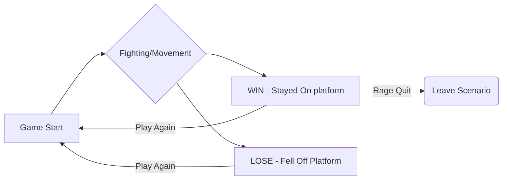

# GDD: BALL BRAWL

**Ball Brawl** is a competitive two-player game where you shoot exercise balls at your opponent in an attempt to knock them off the platform!

# Controls and How to Play 

Joystick to move (Up to move forward, Down to move backwards, and left and right to rotate), Primary Button to Jump, Secondary Button to shoot the exercise balls. Win by knocking the other player off the background - be careful to not fall off the platform yourself! 

## Team Objectives
- The game play is meant to be fast and frantic, with players having to act quickly lest they get ousted off the platform! Therefore, all elements need to be in service of that "vibe".
- Make an easy to pick-up-and-play dueling game that would encourage competitive and energetic play!
- We’ve seen this general concept work in other games, but those games usually rely on slower style of play. *We want to find out if and how this style of play might be enjoyable in this sped-up context*. 
- We hope that this game will have an inherent replay value - especially in a casual “best out of three, okay?” way.

## Concept Material

[Super Special Concept Art](https://postimg.cc/w7P1yzBD)

## Who is Team 11?

Team 11 is made up of **Dave Conventry, Jen Rodriguez Corpas,** and **Rowen Daley**.  

**Dave** (He/Him)
> Coding, Github Managment

**Jen** (She/Her)
> Coding, Github Managment 

**Rowen** (She/Her)
> Presentation, GDD

## Inspirations

- *Wii Resort* (specifically the "Swordplay" levels)
- *Nidhogg* (1 and 2)
- Sumo Wrestling
- Dodgeball

## Flow of Play

Note that the flow being depicted here is from the POV of ONE of the players, not both!

